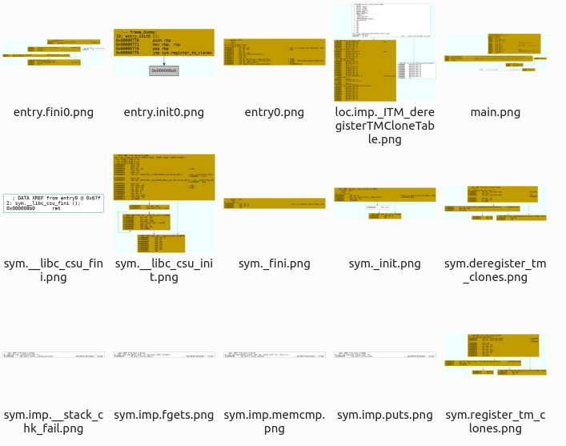

# Graph CFG thumbnails

Quentin Husson - Louis Galland

Forensic - Project B3

-------------------------------------------------

This tool generates thumbnails for CFG of functions from binary files.

It takes all function of a binary executable and generates their CFG in 10x10cm in `.PNG` format. It is based on [radare2](https://github.com/radareorg/radare2) and [Graphviz](https://gitlab.com/graphviz/graphviz/).

## Installation

The installation is really simple, with few dependencies:

```bash
apt install radare2 graphviz imagemagick
```

## Usage

To graph all functions' CFG:
```bash
./bincfg.sh -n BINARY_PATH -F
```

Thumbnails will be saved in `./BINARY_PATH_CFG/`.

--------------------------------------------

**Others features:**
```bash
./bincfg.sh -h # Display the help
./bincfg.sh -n BINARY_PATH -c # Graph the global CFG of the binary
./bincfg.sh -n BINARY_PATH -l # List all functions of the binary
./bincfg.sh -n BINARY_PATH -f function_name # Graph the CFG of a specific function
```

## Screenshot

Here is a screenshot of thumbnails for a tiny binary:


